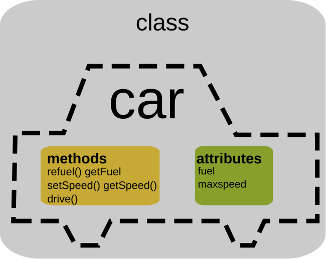

# Silvia Vilar - pdf-web
## Introducción a la POO 

La programación Orientada a Objetos es un modelo de programación que consiste percibir los elementos a programar como objetos provistos de cualidades o propiedades (atributos) y capaces de realizar acciones (comportamiento).

Por ejemplo, un coche es un objeto del mundo real con atributos (definen el estado del objeto) y que puede ejecutar distintos métodos (definen cómo se comporta el objeto)

\newpage
\Begin{figure}
\centering
\includegraphics[scale=1]{./imgs/CocheIntroPOO.png)
\caption{Ejemplo Coche2}

\End{figure}

\newpage
## Abstracción

La abstracción es la capacidad de aislar propiedades o características de los elementos que nos rodean.

Por ejemplo, el concepto de mesa puede ser distinto para cada persona (mesa de comedor, mesa de clase, mesa de negocios, mesa de cocina, mesa de escritorio o incluso un buró)

Si aplicamos la abstracción, se intuye una superficie plana, sujeta por unas patas y con la funcionalidad para poder realizar tareas varias como escribir, comer, etc. Además puede ser de varios materiales y colores

> **Ejemplo: Abstracción de una mesa**
>
> | Atributos | Métodos |
> |-------------|-------------|
> | estado    | comerEn Mesa()     |
> | color     | prepararMesa()    |
> | material     | quitarMesa()    |
> | numPatas     | trabajarEnMesa()    |
> | tamañoSuperficie     | estudiarEn Mesa()    |

::: note
*Nota:* Más adelante veremos cómo plasmar estos atributos y métodos usando Java
:::

\newpage
\Begin {landscape}
\Begin{multicols}{3}
Columna1

Columna2

Columna3

\End{multicols}

\End{landscape}